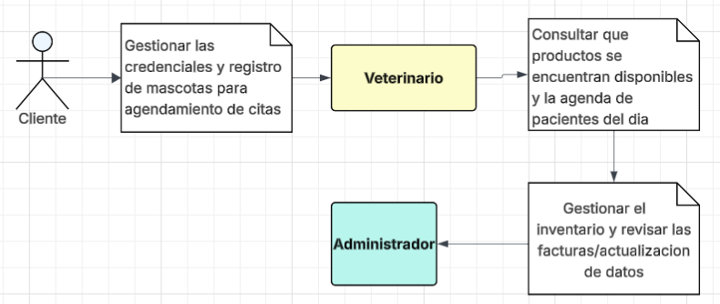

## Integrante

### Juan Andres Suarez Fonseca 

# Enunciado

La empresa PetCare 360 quiere modernizar la manera en que las veterinarias gestionan sus servicios y la relación con los clientes. Buscan una plataforma que permita:
Registrar mascotas con sus características (raza, edad, historial médico).
Agendar citas médicas y asignar veterinarios.
Vender productos de cuidado animal (alimentos, medicamentos, accesorios).
Generar facturación electrónica para cada servicio o compra.

Su reto es diseñar, construir e implementar la primera versión del sistema, siguiendo buenas prácticas de ingeniería de software, aplicando patrones de diseño, principios SOLID, pruebas y diagramación.

### Configurar dependencias iniciales

- JUnit
- Jacoco
- SonarQuebe
- Lombok
- Swagguer ui

### Diagrama de contexto 

### Diagrama casos de uso

### Diagrama de clases

### Patrones de diseño 

- Factory Method : Centraliza la creación de objetos complejos (órdenes, facturas) y oculta la lógica de construcción .
- Strategy: Evita condicionales extendidos y facilita añadir nuevos canales sin modificar código existente .
- Command: Encapsula una solicitud como un objeto para agendar/cancelar citas, procesar pedidos .

### Principios SOLID

# *Single Responsibility Principle (SRP)*

Cómo se cumple: Cada clase tiene una única responsabilidad, entidades del dominio (Mascota, Cita) representan estado; Repositorios gestionan persistencia; Servicios de dominio realizan operaciones de negocio

